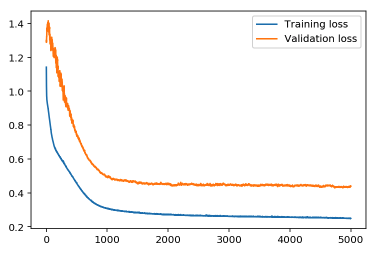
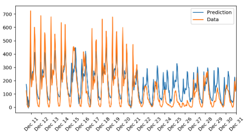

# Deep Learning - Bike Sharing Pattern

## Table of Contents
- [Overview](#Overview)
- [Dependencies](#Dependencies)
- [Code](#Code)
- [Running the code](#Running-the-code)
- [Result](#Result)

## Overview
In following project, neural network is used to predict daily bike rental ridership. Bike sharing dataset , which includes weather, season, humidity, temperature, etc, is used for training and testing the neural network.

## Dependencies

This project requires **Python 3** and the following Python libraries installed:

- [NumPy](http://www.numpy.org/)
- [Pandas](http://pandas.pydata.org)
- [matplotlib](http://matplotlib.org/)

You will also need to have software installed to run and execute a [Jupyter Notebook](http://ipython.org/notebook.html)

If you do not have Python installed yet, it is highly recommended that you install the [Anaconda](http://continuum.io/downloads) distribution of Python, which already has the above packages and more included. Make sure that you select Python 3.x installer.

## Code

Template code is provided in the `customer_segments.ipynb` notebook file. You will also be required to use the included `visuals.py` Python file and the `customers.csv` dataset file to complete your work. While some code has already been implemented to get you started, you will need to implement additional functionality when requested to successfully complete the project. Note that the code included in `visuals.py` is meant to be used out-of-the-box and not intended for students to manipulate. If you are interested in how the visualizations are created in the notebook, please feel free to explore this Python file.

## Running the Code

In a terminal or command window, navigate to the top-level project directory `customer_segments/` (that contains this README) and run one of the following commands:

```bash
ipython notebook customer_segments.ipynb
```  
or
```bash
jupyter notebook customer_segments.ipynb
```

## Result

Neural network has been trained for 5000 epochs. From image below, loss was gradually decreased for 1000 epochs. However, after 1000th epochs, rate of decrease in loss has bin lowered.


For final result, model was able to predict generalized pattern of bike sharing ridership. From December  11 to December 21, model predicted pattern with high accuracy. However, from December 22 to December 26, accuracy has decreased gradually. From here, we identify that model has some shortcomings.


In order to improve model further, much larger dataset, better neural network algorithm with more hidden layers, drop-out mechanism, or a pre-trained algorithm could be implemented.
